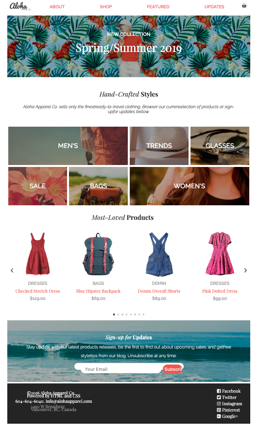

# Aloha Apparel - **Project One**

This is the first project of the Web Developer  program at RED Academy. This project involves a creation of a responsive webpage for mobile, tablet and desktop with a lot of usage of HTML and CSS, with some JavaScript, Git and GitHub.

## Pre-requirements for the project

All pre-requirements for this project were taken in consideration, according to the file from Red Academy for *Project 1*

## Versions
All versions of the _**Aloha**_ are in GitHub for evaluation with the proper comments of what was included or achieved in each new version until the final one.

## Some of the tecnologie envolved in this projects include:
* Use of HMTL5, syntax, semantical, links to other files and url, images, icons
    *Proper identifiers (header, footer, span, p, h1, h2, nav, form, classes, id)

* Use of CSS as a separated file to the folder, using the mobile first approach, box concepts, flex box display, different fonts, colors and background images
    * External fonts from Google fonts
    * Reset file
    * External CSS files for Flickty

* Use of Javascript for the caroussel (Flickty) and for the shopping cart, using apropriate variables and methods

* Usage of Terminal, Git and GitHub

## Author
This project was done by Alex Faissal, as a first assigment of the Web Developer program from Red Academy.

## Acknowledgements
This projects was an achievement made with a lot of efort and a lot of support from the instructors and classroom mates, who were, all, always available for me anytime.

